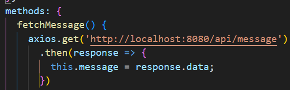
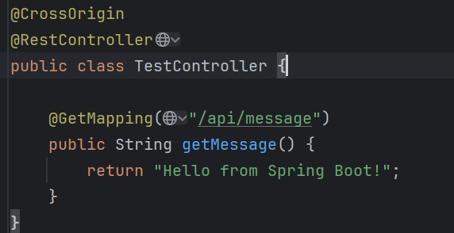

# RESTful API——前后端交互. 设计RESTful API

定义API的端点（Endpoints），这些端点应该清晰地反映出资源和动作。

#### 用户管理
- **注册用户**
  - **POST** `/api/users/register`
- **用户登录**
  - **POST** `/api/users/login`

#### 问卷管理
- **创建问卷**
  - **POST** `/api/surveys`
- **获取用户的问卷列表**
  - **GET** `/api/surveys`
- **更新问卷**
  - **PUT** `/api/surveys/{surveyId}`
- **删除问卷**
  - **DELETE** `/api/surveys/{surveyId}`
- **获取问卷详细信息**
  - **GET** `/api/surveys/{surveyId}`

#### 响应收集
- **提交问卷响应**
  - **POST** `/api/responses`
- **查看问卷响应**
  - **GET** `/api/surveys/{surveyId}/responses`

# 前后端交互的跨域问题

要在本地同时进行前后端项目的通信和API调用，你可以使用以下几种常见的方法来设置你的开发环境。这里假设你已经有一个使用Vue.js的前端项目和一个使用Spring Boot的后端项目。

### 1. 使用同一个端口（避免跨域问题）

在开发环境中，最常见的问题之一是跨域资源共享（CORS）问题，它发生在前端应用尝试从与其不同的端口或域名的后端服务请求数据时。要解决这个问题，你可以：

#### 配置Spring Boot以允许跨域请求
在Spring Boot应用中，你可以添加一个跨域映射配置，这将允许来自前端服务器的跨域请求：

```java
import org.springframework.context.annotation.Bean;
import org.springframework.context.annotation.Configuration;
import org.springframework.web.servlet.config.annotation.CorsRegistry;
import org.springframework.web.servlet.config.annotation.WebMvcConfigurer;

@Configuration
public class WebConfig implements WebMvcConfigurer {
    @Override
    public void addCorsMappings(CorsRegistry registry) {
        registry.addMapping("/**")  // 允许跨域请求的路径
                .allowedOrigins("http://localhost:8080")  // 前端服务器的地址
                .allowedMethods("GET", "POST", "PUT", "DELETE", "OPTIONS")  // 允许的HTTP方法
                .allowCredentials(true).maxAge(3600);
    }
}
```

### 2. 前端代理配置

如果你使用Vue CLI创建的项目，你可以在Vue项目中配置一个代理，这样所有API请求都会被发送到后端服务器，而浏览器会认为这些请求与前端是同源的。

在Vue项目的根目录下的 `vue.config.js` 文件中配置代理：

```javascript
module.exports = {
    devServer: {
        proxy: {
            '/api': {
                target: 'http://localhost:8080',  // Spring Boot应用的地址和端口
                changeOrigin: true,
                pathRewrite: {
                    '^/api': ''
                }
            }
        }
    }
}
```

这个配置告诉开发服务器将所有以 `/api` 开始的请求代理到 `http://localhost:8080`。这样，前端开发服务器（通常在端口8081或其他端口上）会代理这些请求到你的后端服务，解决了跨域问题。

### 3. 同时启动前后端项目

- 对于**后端**（Spring Boot），在IDEA中直接运行应用或通过命令行使用 `mvn spring-boot:run`
- 对于**前端**（Vue.js），在前端项目的根目录中打开终端，运行 `npm run serve`。

这样配置后，你的前端和后端项目可以在本地同时运行，并且能够顺利地进行通信和API调用，无需担心跨域问题。你的前端应用可以通过如 `http://localhost:8081/api/users` 的URL访问后端API（假设8081是前端端口）。


# 后端配置

要在Spring Boot后端项目中结合MyBatis和MySQL来改进API的处理，你首先需要配置这些组件以支持数据库操作。下面的步骤将指导你如何整合这些技术，以及如何对之前提到的问卷星系统的API进行改进，使其能够进行实际的数据库操作。

### 1. 添加依赖（项目已经添加好了——无需理会）

首先，确保你的Spring Boot项目中包含了MyBatis和MySQL的依赖。如果你使用Maven作为构建工具，可以在`pom.xml`中添加以下依赖：

```xml
<!-- Spring Boot Starter for MyBatis -->
<dependency>
    <groupId>org.mybatis.spring.boot</groupId>
    <artifactId>mybatis-spring-boot-starter</artifactId>
    <version>2.2.0</version>
</dependency>

<!-- MySQL JDBC Driver -->
<dependency>
    <groupId>mysql</groupId>
    <artifactId>mysql-connector-java</artifactId>
    <version>8.0.25</version>
</dependency>

<!-- Spring Boot Starter for Data JPA -->
<dependency>
    <groupId>org.springframework.boot</groupId>
    <artifactId>spring-boot-starter-data-jpa</artifactId>
</dependency>
```

### 2. 配置数据库（注意在自己开发过程中，修改为自己的数据库（用户名、密码等））

在`application.properties`或`application.yml（本项目修改为yml后缀）`文件中，配置数据库连接：

```properties
# MySQL 数据库配置
spring.datasource.url=jdbc:mysql://localhost:3306/questionnaire_db?useSSL=false&serverTimezone=UTC
spring.datasource.username=root
spring.datasource.password=yourpassword
spring.datasource.driver-class-name=com.mysql.cj.jdbc.Driver

# MyBatis 配置
mybatis.type-aliases-package=com.example.questionnaire.model
mybatis.mapper-locations=classpath:mapper/*.xml
```

确保你已经在MySQL中创建了数据库（在这个例子中是`questionnaire_db`）。

# 前后目录结构推荐

在Vue前端和Spring Boot后端的项目中合理地组织和分配API可以极大地提高项目的可维护性和可扩展性。下面是如何在这两个环境中组织API调用代码的一些建议：

### Spring Boot 后端

在Spring Boot项目中，你可以创建一个专门的包来管理所有与API相关的类和接口，通常这包括控制器（Controllers）、服务（Services）、数据访问对象（DAOs 或 Repositories）、实体（Entities）和辅助类（Helpers 或 Utils）。

**建议的目录结构如下：**

```
src/
└── main/
    ├── java/
    │   └── com/
    │       └── example/
    │           └── questionnaire/
    │               ├── config/          # 配置类目录
    │               ├── controller/      # 控制器目录
    │               ├── service/         # 服务层目录
    │               ├── repository/      # 数据访问层目录
    │               ├── model/           # 实体类目录
    │               └── dto/             # 数据传输对象目录
    └── resources/
        ├── application.properties      # 应用配置文件
        └── mapper/                     # MyBatis映射文件
```

- **控制器（Controllers）**：处理HTTP请求，调用服务层处理业务逻辑，并返回响应。
- **服务（Services）**：包含业务逻辑，通常与数据库的交互也在这一层通过调用数据访问层完成。
- **数据访问层（Repositories）**：直接与数据库交互，用于数据的CRUD操作。
- **实体（Models）**：表示数据库表的数据结构。

### Vue 前端

在Vue项目中，管理API调用通常通过服务层（service layer）来实现，这可以通过使用专门的API服务文件来管理所有的HTTP请求。

**建议的目录结构如下：**

```
src/
├── components/    # Vue组件
├── views/         # 页面视图
├── router/        # 路由定义
├── store/         # Vuex状态管理
├── services/      # API服务
│   ├── ApiService.js     # 用于配置Axios实例
│   └── SurveyService.js  # 处理所有与问卷相关的API请求
└── App.vue
```

**API服务示例：**

在`services/`目录下，你可以创建一个`ApiService.js`文件来配置Axios实例，并创建`SurveyService.js`来处理与问卷相关的所有API请求。

```javascript
// services/ApiService.js
import axios from 'axios';

const ApiService = axios.create({
  baseURL: 'https://api.questionnairestar.com/api',
  headers: {
    'Content-Type': 'application/json'
  }
});

export default ApiService;

// services/SurveyService.js
import ApiService from './ApiService';

const SurveyService = {
  getSurveys() {
    return ApiService.get('/surveys');
  },
  createSurvey(data) {
    return ApiService.post('/surveys', data);
  },
  updateSurvey(id, data) {
    return ApiService.put(`/surveys/${id}`, data);
  },
  deleteSurvey(id) {
    return ApiService.delete(`/surveys/${id}`);
  }
};

export default SurveyService;
```

# API调用

要将Spring Boot与MyBatis结合，并与Vue前端对接，首先确保后端能正确处理前端的请求，并使用MyBatis进行数据库操作。下面，我会分别给出后端和前端的代码示例，确保它们可以顺畅地一起工作。

### Spring Boot 后端设置

首先，我们设置MyBatis来操作数据库，并处理来自Vue前端的API请求。

#### 1. MyBatis Mapper接口

定义一个MyBatis Mapper接口用于数据库操作：

```java
// SurveyMapper.java
package com.example.questionnaire.mapper;

import com.example.questionnaire.model.Survey;
import org.apache.ibatis.annotations.*;

import java.util.List;

@Mapper
public interface SurveyMapper {

    @Select("SELECT * FROM surveys")
    List<Survey> findAll();

    @Insert("INSERT INTO surveys(title, description) VALUES(#{title}, #{description})")
    @Options(useGeneratedKeys = true, keyProperty = "id")
    void insert(Survey survey);

    @Update("UPDATE surveys SET title = #{title}, description = #{description} WHERE id = #{id}")
    void update(Survey survey);

    @Delete("DELETE FROM surveys WHERE id = #{id}")
    void delete(Long id);
}
```

#### 2. Service层

Service层调用Mapper接口完成业务逻辑：

```java
// SurveyService.java
package com.example.questionnaire.service;

import com.example.questionnaire.mapper.SurveyMapper;
import com.example.questionnaire.model.Survey;
import org.springframework.stereotype.Service;

import java.util.List;

@Service
public class SurveyService {

    private final SurveyMapper surveyMapper;

    public SurveyService(SurveyMapper surveyMapper) {
        this.surveyMapper = surveyMapper;
    }

    public List<Survey> findAllSurveys() {
        return surveyMapper.findAll();
    }

    public Survey createSurvey(Survey survey) {
        surveyMapper.insert(survey);
        return survey;
    }

    public Survey updateSurvey(Long id, Survey survey) {
        survey.setId(id);
        surveyMapper.update(survey);
        return survey;
    }

    public void deleteSurvey(Long id) {
        surveyMapper.delete(id);
    }
}
```

#### 3. Controller层

Controller层处理HTTP请求，并调用Service层：

```java
// SurveyController.java
package com.example.questionnaire.controller;

import com.example.questionnaire.model.Survey;
import com.example.questionnaire.service.SurveyService;
import org.springframework.beans.factory.annotation.Autowired;
import org.springframework.http.ResponseEntity;
import org.springframework.web.bind.annotation.*;

import java.util.List;

@RestController
@RequestMapping("/api/surveys")
public class SurveyController {

    @Autowired
    private SurveyService surveyService;

    @GetMapping
    public ResponseEntity<List<Survey>> getAllSurveys() {
        return ResponseEntity.ok(surveyService.findAllSurveys());
    }

    @PostMapping
    public ResponseEntity<Survey> createSurvey(@RequestBody Survey survey) {
        return ResponseEntity.ok(surveyService.createSurvey(survey));
    }

    @PutMapping("/{id}")
    public ResponseEntity<Survey> updateSurvey(@PathVariable Long id, @RequestBody Survey survey) {
        return ResponseEntity.ok(surveyService.updateSurvey(id, survey));
    }

    @DeleteMapping("/{id}")
    public ResponseEntity<Void> deleteSurvey(@PathVariable Long id) {
        surveyService.deleteSurvey(id);
        return ResponseEntity.ok().build();
    }
}
```

### Vue 前端设置

前端使用Vue.js，通过Axios与后端进行通信：

#### 1. Axios API服务配置

在Vue项目中，配置Axios以调用后端API：

```javascript
// services/ApiService.js
import axios from 'axios';

const ApiService = axios.create({
  baseURL: 'https://api.questionnairestar.com/api',
  headers: {
    'Content-Type': 'application/json'
  }
});

export default ApiService;
```

#### 2. SurveyService API接口

具体实现API调用的服务：

```javascript
// services/SurveyService.js
import ApiService from './ApiService';

const SurveyService = {
  getSurveys() {
    return ApiService.get('/surveys');
  },
  createSurvey(data) {
    return ApiService.post('/surveys', data);
  },
  updateSurvey(id, data) {
    return ApiService.put(`/surveys/${id}`, data);
  },
  deleteSurvey(id) {
    return ApiService.delete(`/surveys/${id}`);
  }
};

export default SurveyService;
```

### 结合Vue组件调用

在Vue组件中，调用`SurveyService`来进行CRUD操作：

```javascript
// components/SurveyComponent.vue
<template>
  <!-- HTML for displaying surveys -->
</template>

<script>
import SurveyService from '../services/SurveyService';

export default {
  data()
```

# 前后端交互对象

### 前端 - Vue.js

**发送HTTP请求的部分：**
- 在Vue.js项目中，通常由`services/`目录下的服务文件负责发送HTTP请求。这些服务使用Axios库创建HTTP请求到后端API。
- 服务层的作用是封装API调用逻辑，使其可以被不同的组件重用。

**示例 - SurveyService.js**
```javascript
// services/SurveyService.js
import ApiService from './ApiService';

const SurveyService = {
  getSurveys() {
    return ApiService.get('/surveys');
  },
  createSurvey(data) {
    return ApiService.post('/surveys', data);
  },
  updateSurvey(id, data) {
    return ApiService.put(`/surveys/${id}`, data);
  },
  deleteSurvey(id) {
    return ApiService.delete(`/surveys/${id}`);
  }
};

export default SurveyService;
```

### 后端 - Spring Boot

**接收HTTP请求的部分：**
- 在Spring Boot项目中，由`controller/`目录下的控制器类负责接收HTTP请求。控制器使用Spring MVC的注解来映射URL到具体的处理函数。

**示例 - SurveyController.java**
```java
// SurveyController.java
package com.example.questionnaire.controller;

import com.example.questionnaire.model.Survey;
import com.example.questionnaire.service.SurveyService;
import org.springframework.http.ResponseEntity;
import org.springframework.web.bind.annotation.*;

@RestController
@RequestMapping("/api/surveys")
public class SurveyController {

    private final SurveyService surveyService;

    public SurveyController(SurveyService surveyService) {
        this.surveyService = surveyService;
    }

    @GetMapping
    public ResponseEntity<List<Survey>> getAllSurveys() {
        return ResponseEntity.ok(surveyService.findAllSurveys());
    }

    @PostMapping
    public ResponseEntity<Survey> createSurvey(@RequestBody Survey survey) {
        return ResponseEntity.ok(surveyService.createSurvey(survey));
    }

    @PutMapping("/{id}")
    public ResponseEntity<Survey> updateSurvey(@PathVariable Long id, @RequestBody Survey survey) {
        return ResponseEntity.ok(surveyService.updateSurvey(id, survey));
    }

    @DeleteMapping("/{id}")
    public ResponseEntity<Void> deleteSurvey(@PathVariable Long id) {
        surveyService.deleteSurvey(id);
        return ResponseEntity.noContent().build();
    }
}
```

### RESTful API 约束文档

**基本URL:** `https://api.questionnairestar.com/api`

| Method | URL           | Action           | Request Body | Response Body   | Status Codes                           |
| ------ | ------------- | ---------------- | ------------ | --------------- | -------------------------------------- |
| GET    | /surveys      | 获取所有问卷     | None         | List of Surveys | 200 OK, 404 Not Found                  |
| POST   | /surveys      | 创建新问卷       | Survey data  | Created Survey  | 201 Created, 400 Bad Request           |
| PUT    | /surveys/{id} | 更新指定ID的问卷 | Survey data  | Updated Survey  | 200 OK, 404 Not Found, 400 Bad Request |
| DELETE | /surveys/{id} | 删除指定ID的问卷 | None         | None            | 204 No Content, 404 Not Found          |

### 前后端交互的对象要求

- **Survey对象：**
  - **前端发送对象（JSON格式）：**
    ```json
    {
      "title": "Customer Feedback",
      "description": "Survey about your experience."
    }
    ```
  - **后端接收对象（Java类）：**
    ```java
    public class Survey {
        private Long id;
        private String title;
        private String description;
        // getters and setters
    }
    ```

通过这样的配置和约定，前端和后端可以高效、一致地交互数据，同时保持了代码的可维护性和可扩展性。

## json和java对象转换

在一个现代的web应用中，前端（Vue.js）和后端（Spring Boot）通过HTTP协议进行通信。这通常涉及到发送和接收JSON对象。下面我将详细介绍如何在Vue前端发送对象，以及在Spring Boot后端接收这些对象。

### Vue.js 前端发送对象

在Vue.js应用中，你可以使用Axios库来发送HTTP请求，并且传输JSON对象。Axios是一个基于Promise的HTTP客户端，用于浏览器和node.js。

#### 安装Axios

如果还没有安装Axios，可以通过npm或yarn安装：

```bash
npm install axios
```

或者

```bash
yarn add axios
```

#### 发送对象示例

假设你有一个表单用于创建新的问卷，你需要从这个表单收集数据，并将其作为JSON对象发送到后端。

**Vue组件示例:**

```javascript
<template>
  <div>
    <input v-model="survey.title" placeholder="Enter survey title" />
    <textarea v-model="survey.description" placeholder="Enter survey description"></textarea>
    <button @click="submitSurvey">Submit Survey</button>
  </div>
</template>

<script>
import SurveyService from '@/services/SurveyService';

export default {
  data() {
    return {
      survey: {
        title: '',
        description: ''
      }
    };
  },
  methods: {
    submitSurvey() {
      SurveyService.createSurvey(this.survey).then(response => {
        console.log('Survey created:', response.data);
      }).catch(error => {
        console.error('Error creating survey:', error);
      });
    }
  }
}
</script>
```

在这个组件中，`v-model`用于双向绑定输入框和文本区域的值到`survey`对象。当用户点击提交按钮时，`submitSurvey`方法会被触发，该方法通过`SurveyService`调用后端API。

**SurveyService.js:**

```javascript
import ApiService from './ApiService';

const SurveyService = {
  createSurvey(survey) {
    return ApiService.post('/surveys', survey);
  }
};

export default SurveyService;
```

### Spring Boot 后端接收对象

在Spring Boot中，你可以使用`@RestController`注解的类接收来自前端的请求，并通过`@RequestBody`注解自动将接收到的JSON对象反序列化为Java对象。

**SurveyController.java:**

```java
package com.example.questionnaire.controller;

import com.example.questionnaire.model.Survey;
import com.example.questionnaire.service.SurveyService;
import org.springframework.beans.factory.annotation.Autowired;
import org.springframework.http.ResponseEntity;
import org.springframework.web.bind.annotation.*;

@RestController
@RequestMapping("/api/surveys")
public class SurveyController {

    @Autowired
    private SurveyService surveyService;

    @PostMapping
    public ResponseEntity<Survey> createSurvey(@RequestBody Survey survey) {
        Survey createdSurvey = surveyService.createSurvey(survey);
        return ResponseEntity.ok(createdSurvey);
    }
}
```

在这个控制器中，`@PostMapping`注解用于处理POST请求，`@RequestBody`注解告诉Spring Boot将请求体（JSON对象）映射到`Survey`类的一个实例。这个类实例随后被传递到`surveyService.createSurvey`方法处理业务逻辑。

### 总结

这种前后端分离的架构允许Vue.js前端应用通过JSON格式与Spring Boot后端应用通信，同时后端通过标准的Java对象处理业务逻辑。这样的设置保证了应用的灵活性和可扩展性，同时也使得代码更易于管理和维护。

# 任务安排进度

## 一阶段，基本核心任务

1、**陈--**前端实现问卷的创建包括主界面界面的表现的实现（保存在前端），待点击保存后再像后端发送请求创建表格（问卷），

​	先在本地保存

​	这种方法涉及到在用户填写表单的过程中，将数据临时保存在前端，通常在组件的状态（如Vue的data属性）或全局状态管理库（如Vuex）	中。数据只有在用户完成所有输入，并点击“保存”或“提交”按钮时，才一次性发送到后端服务器进行存储。

2、**黄--**后端实现问卷的创建，（使用mysql结合mybatis框架实现），能够接收前端的json数据，化为java类进行数据库中表格的创建

在问卷系统的后端实现中，处理多种问题类型（**单选、多选、评分、填空**）并接收问题的可选项（如单选和多选题的选项）涉及到对模型类的设计进行一些扩展。具体来说，你需要在`Question`类中添加支持多种问题类型的属性，并对`Survey`类进行适当的调整以支持这些扩展。这里是一种可能的实现方式：

3、**石--**计划问卷修改、提交的前后交互设计，以及后端实现

4、**赖**--用户填写问卷的实现，https://example.com/surveys/12345，先展开前端部分

**注意：在后端没有实现时候，可以采用模拟数据，存储在本地，来替代从后端获取消息**

### RESTful API 约束文档--要求前端交互的http请求格式如下，阶段一采取第二行的内容

**其它风格的请求：**

axios({
  url: 'http://localhost:8080/graphql',
  method: 'post',
  data: {
    query: `
      query {
        message {
          id
          content
        }
      }
    `
  }
}).then((result) => {
  this.message = result.data;
});

下面全都是restful规范下的api（Resource Representational State Transfer）

示例：

[RESTful风格示例](https://juejin.cn/post/6844904071640383502)

以用户（User）的增删改查为例，我们可以设计出一下接口形式：每列分别对应，（请求类型：请求地址：功能描述）

- get ： /user/list ：获取所有用户信息
- post：/user：创建用户信息
- put：/user：更新用户信息
- get：/user/1：获取资源标识（id）为1的用户信息
- delete：/user/1：删除资源标识（id）为1的用户信息

这里是们项目的示例api

**基本URL:** `https://localhost:8080/api`

发送请求时需要以api做前缀：



后端接收请求会检测



| Method | URL           | Action           | Request Body | Response Body   | Status Codes                           |
| ------ | ------------- | ---------------- | ------------ | --------------- | -------------------------------------- |
| GET    | /surveys      | 获取所有问卷     | None         | List of Surveys | 200 OK, 404 Not Found                  |
| POST   | /surveys      | 创建新问卷       | Survey data  | Created Survey  | 201 Created, 400 Bad Request           |
| PUT    | /surveys/{id} | 更新指定ID的问卷 | Survey data  | Updated Survey  | 200 OK, 404 Not Found, 400 Bad Request |
| DELETE | /surveys/{id} | 删除指定ID的问卷 | None         | None            | 204 No Content, 404 Not Found          |


这是示范：但是要求数据交换对象的基本格式按照下方来进行

### 扩展 Question 类

你可以在`Question`类中添加更多属性来支持不同类型的问题。这里，我们使用一个`options`列表来存储单选和多选问题的选项，并为评分类型问题添加一个`scale`属性：

```java
import java.util.List;

public class Question {
    private Long id;
    private String type;
    private String text;
    private List<String> options; // 存储单选和多选问题的选项
    private Integer scale; // 用于评分类型的问题

    // Getters and setters
    public Long getId() {
        return id;
    }

    public void setId(Long id) {
        this.id = id;
    }

    public String getType() {
        return type;
    }

    public void setType(String type) {
        this.type = type;
    }

    public String getText() {
        return text;
    }

    public void setText(String text) {
        this.text = text;
    }

    public List<String> getOptions() {
        return options;
    }

    public void setOptions(List<String> options) {
        this.options = options;
    }

    public Integer getScale() {
        return scale;
    }

    public void setScale(Integer scale) {
        this.scale = scale;
    }
}
```

### 调整 Survey 类

在`Survey`类中，你需要确保`questions`属性能够正确地引用这些扩展后的`Question`对象：

```java
import java.util.List;

public class Survey {
    private Long id;
    private String title;
    private String description;
    private List<Question> questions; // 引用扩展后的Question对象列表

    // Getters and setters
    public Long getId() {
        return id;
    }

    public void setId(Long id) {
        this.id = id;
    }

    public String getTitle() {
        return title;
    }

    public void setTitle(String title) {
        this.title = title;
    }

    public String getDescription() {
        return description;
    }

    public void setDescription(String description) {
        this.description = description;
    }

    public List<Question> getQuestions() {
        return questions;
    }

    public void setQuestions(List<Question> questions) {
        this.questions = questions;
    }
}
```

### 后端接收和处理数据

当前端发送问卷数据时，Spring Boot的控制器需要能够接收并处理这些数据。这通常通过定义一个接收POST请求的API端点完成：

```java
import org.springframework.http.ResponseEntity;
import org.springframework.web.bind.annotation.*;

@RestController
@RequestMapping("/api/surveys")
public class SurveyController {

    @PostMapping
    public ResponseEntity<Survey> createSurvey(@RequestBody Survey survey) {
        // 处理创建问卷逻辑，保存到数据库
        return ResponseEntity.ok(surveyService.createSurvey(survey));
    }
}
```

在设计灵活且可扩展的问卷系统时，处理前端发送的JSON对象中可能不存在的属性（如问题的选项或评分尺度）是一项常见需求。在Java后端（使用Spring Boot）处理这种情况需要确保模型类能够适当地处理空值，同时在JSON序列化和反序列化过程中正确地管理可选字段。

### 处理可选属性的方法--重点

1. **在Java模型类中使用对象包装类型**:
   对于可选的数值字段，如评分的`scale`，可以使用`Integer`而不是`int`，因为对象类型可以接受`null`值。对于列表类型，如`options`，Java的`List`本身就可以接受`null`值。

   ```java
   public class Question {
       private Long id;
       private String type;
       private String text;
       private List<String> options;  // 可以为 null
       private Integer scale;  // 可以为 null
   
       // getters and setters
   }
   ```

2. **在JSON处理中配置可忽略的属性**:
   使用Jackson库（Spring Boot默认的JSON库）时，可以配置在序列化和反序列化过程中忽略`null`值。这可以通过在`application.properties`或`application.yml`中添加配置项来实现：

   ```properties
   spring.jackson.default-property-inclusion=non_null
   ```

   这样配置后，所有为`null`的字段都不会包含在序列化后的JSON中，同时在反序列化时也不会期望这些字段。

3. **在Controller层处理接收的数据**:
   当从前端接收到JSON数据时，Spring Boot的`@RestController`将使用Jackson自动将JSON转换为Java对象。如果JSON中缺少某些字段，对应的Java对象字段将被设置为`null`。你可以添加逻辑来处理这些可能为`null`的字段。

   ```java
   @PostMapping
   public ResponseEntity<Survey> createSurvey(@RequestBody Survey survey) {
       // 逻辑处理，比如根据问题类型检查 options 和 scale 是否为 null
       survey.getQuestions().forEach(question -> {
           if ("multiple-choice".equals(question.getType()) || "single-choice".equals(question.getType())) {
               if (question.getOptions() == null) {
                   throw new ResponseStatusException(HttpStatus.BAD_REQUEST, "Options are required for choice questions");
               }
           }
           if ("rating".equals(question.getType())) {
               if (question.getScale() == null) {
                   throw new ResponseStatusException(HttpStatus.BAD_REQUEST, "Scale is required for rating questions");
               }
           }
       });
   
       return ResponseEntity.ok(surveyService.createSurvey(survey));
   }
   ```

4. **前端处理发送数据**:
   在Vue.js应用中，确保在发送数据前不必手动清除`null`值的字段，因为后端配置已经能够妥善处理它们。

   ```javascript
   methods: {
       submitSurvey() {
           ApiService.post('/surveys', this.survey)
             .then(response => {
                 // 提交成功逻辑
             })
             .catch(error => {
                 // 错误处理逻辑
             });
       }
   }
   ```

### 总结

这种设计使得问卷系统能够灵活地处理各种类型的问题，无论这些问题是否包含所有预期的字段。后端适当地配置以接受和处理`null`值，可以有效地避免处理这些可选字段时可能出现的错误。同时，前端可以根据用户的输入动态地添加或省略某些字段，而不会影响系统的整体功能。

### 问卷的填写

要允许用户通过链接填写特定的问卷，你需要设计前端和后端以支持通过问卷ID来检索和提交问卷数据。这涉及到几个步骤，包括创建问卷的URL结构、加载相应的问卷数据到前端页面，以及处理用户的提交。下面是详细的步骤和实现方式：

### 步骤 1: URL 设计

为每个问卷设计一个唯一的URL，这个URL会包含一个能唯一标识问卷的ID。例如：

```
https://example.com/surveys/12345
```

这里，`12345` 是问卷的ID。

### 步骤 2: 前端实现

在Vue.js应用中，你需要设置路由来处理这种URL，并加载相应的问卷填写组件。

**设置路由（router/index.js）**：

```javascript
import Vue from 'vue';
import Router from 'vue-router';
import SurveyFill from '@/components/SurveyFill'; // 确保你已经创建了这个组件

Vue.use(Router);

export default new Router({
    routes: [
        {
            path: '/surveys/:id',
            name: 'SurveyFill',
            component: SurveyFill
        }
    ]
});
```

**问卷填写组件（SurveyFill.vue）**:

在这个组件中，你需要在创建（`created`）钩子中获取问卷ID，并加载问卷数据：

```vue
<template>
  <div>
    <h1>{{ survey.title }}</h1>
    <p>{{ survey.description }}</p>
    <form @submit.prevent="submitSurvey">
      <!-- 问卷问题渲染 -->
    </form>
  </div>
</template>

<script>
export default {
  data() {
    return {
      survey: {}
    };
  },
  created() {
    this.fetchSurveyData();
  },
  methods: {
    fetchSurveyData() {
      const id = this.$route.params.id;
      axios.get(`/api/surveys/${id}`)
        .then(response => {
          this.survey = response.data;
        })
        .catch(error => {
          console.error('Error fetching survey:', error);
        });
    },
    submitSurvey() {
      // 提交问卷答案的逻辑
    }
  }
}
</script>
```

### 步骤 3: 后端实现

在后端（使用Spring Boot），你需要设置相应的API来返回特定ID的问卷数据和接收填写的数据。

**控制器（SurveyController.java）**:

```java
import org.springframework.beans.factory.annotation.Autowired;
import org.springframework.http.ResponseEntity;
import org.springframework.web.bind.annotation.*;

@RestController
@RequestMapping("/api/surveys")
public class SurveyController {

    @Autowired
    private SurveyService surveyService;

    @GetMapping("/{id}")
    public ResponseEntity<Survey> getSurveyById(@PathVariable Long id) {
        Survey survey = surveyService.getSurveyById(id);
        return ResponseEntity.ok(survey);
    }

    @PostMapping("/{id}/answers")
    public ResponseEntity<?> submitAnswers(@PathVariable Long id, @RequestBody SurveyAnswers answers) {
        surveyService.saveAnswers(id, answers);
        return ResponseEntity.ok().build();
    }
}
```

### 步骤 4: 保障安全性和可访问性

确保问卷链接的安全性和可访问性也很重要，你可能需要考虑以下几点：

- **权限检查**：确保只有授权用户可以访问和填写问卷。
- **防止重复提交**：在前端和后端设置机制，避免用户提交多次答案。

通过以上步骤，你可以实现一个用户能够通过链接访问并填写特定问卷的功能，整个过程包括前端的路由处理和问卷显示，以及后端的数据处理和安全性控制。

