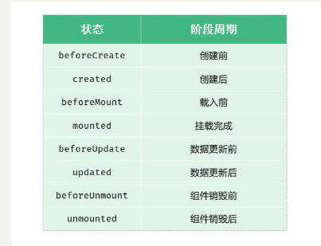
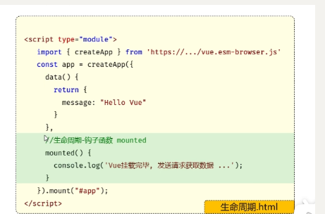
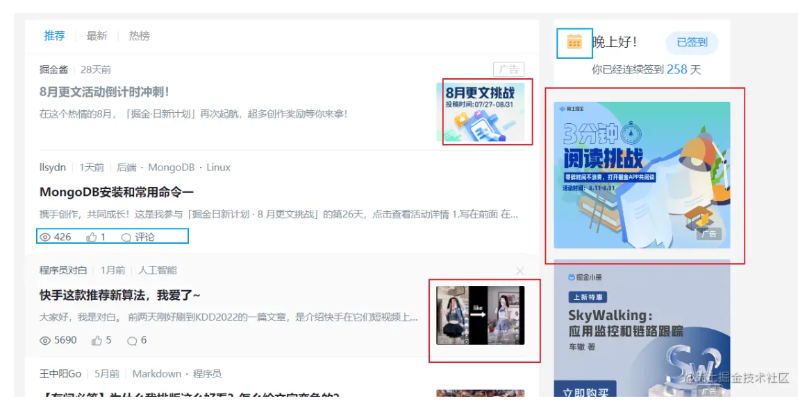
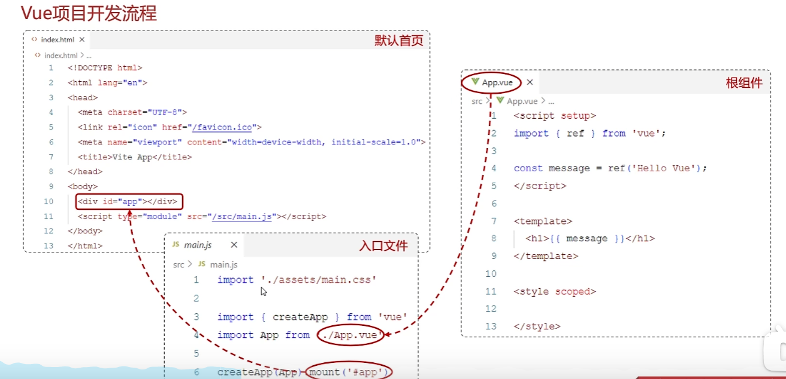
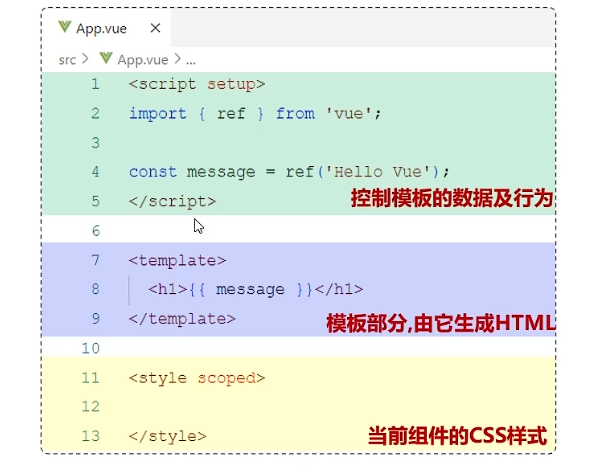

# 缩写术语

**Ajax：****Asynchronous JavaScript And XML**使用异步的方式与服务器通信，不需要中断操作。

**Axios**：ajax i/o system。 是一个基于 Promise 的 HTTP 库，可以用在浏览器和 node.js 中；是请求资源的模块；通过promise对**ajax的封装**。简单来说就是ajax技术实现了局部数据的刷新，aios实现了对ajax的封装，aios有的ajax都有，ajax有axios不一定有。

**Promise：是现代 JavaScript 中异步编程的基础。它是一个由**异步函数返回的对象**，可以指示操作当前所处的状态。在 Promise 返回给调用者的时候，操作往往还没有完成，但 Promise 对象提供了方法来处理操作最终的成功或失败。

**XML:**简介：XML,全称为可扩展标记语言(e**X**tensible **M**arkup **L**anguage),是一种用于描述、传输和存储数据的语言。它被设计用来**传输和存储**数据，与HTML不同，XML的主要目的不在于显示数据，而是**强调数据的结构性。**它是一种标记语言，使用类似HTML的标签表示数据的结构和其他信息。XML提供了一种独立于应用程序或供应商的描述和交换结构化数据的统一方法，非常适合万维网传输。它是互联网环境下跨平台、内容依赖的技术，也
是当今处理分布式结构化信息的有效工具。

**npm:****Node Package Manager**，是一个NodeJS包管理和分发工具，已经成为了非官方的发布Node模块（包）的标准。 2020年3月17日，Github宣布收购npm，GitHub现在已经保证npm将永远免费。

HTML：网页结构

CSS：

# Vue 生命周期

生命周期的八个阶段：每个阶段会自动执行一个生命周期方法（钩子），让开发者有机会在特定的阶段执行自己的代码--**常用mounted**，mounted与函数并列——用来发送（异步请求）请求、获取数据库信息，来渲染信息





# Vue

## Vue项目-目录结构

VUE-PROJECT

- .vscode
- node modules 下载的第三方包存放目录

- public               公共资源（图片）
- **src                     源代码存放目录（以后写代码的文件夹）--绝大部分工作量**
- .gitignore
- index.html        默认首页
- {}package-lock.json项目配置文件（不需要修改）
- {}package.json           项目配置文件，包括项目名、版本号、依赖包、版本等。
- README.md
- vite.config.js        Vue项目的配置信息，如：端口号等

src下又有：

- assets           静态资源目录，存放图片、字体.…
- components组件目录，存放通用组件
- V App.ue      根组件
- main.js          入口文件

### public和assets区别

`public `目录下存放项目需要使用的静态资源，有更新动态显示的需求。

任何放置在 public 文件夹的静态资源都会被简单的复制，而**不经过 webpack**，需要通过**绝对路径来引用**它们。

- 路径设置时无需添加 public/，默认加载 public 文件夹下的图片。
- 不需要使用 require，否则就变成在 src/assets 文件夹寻找。
- 系统编译后，可替换图片

`assets `目录下存放适合存放项目中所必须的图标，属于代码的一部分，只支持**相对路径**形式。

**会通过 webpack 处理**的脚本和样式表会被压缩且打包在一起，**可以避免额外的网络请求**。

- 需要使用 require，运行时就加载；
- 系统编译后，**不能替换，因为被内部编译管理**；

`public`文件夹下的图片等静态资源，不经过 webpack，通过绝对路径来引用，系统编译后，可替换；-红色框

`assets`文件夹下的图片等静态资源，经过 webpack，通过绝相对路径引用，系统**编译后，不能替换**；-蓝色框

**webpack** 是一个用于现代 JavaScript 应用程序的 *静态模块打包工具*。当 webpack 处理应用程序时，它会在内部从一个或多个入口点构建一个 [依赖图(dependency graph)](https://webpack.docschina.org/concepts/dependency-graph/)，然后将你项目中所需的每一个模块组合成一个或多个 *bundles*，它们均为静态资源，用于展示你的内容。



## 开发流程

重点在Vue文件的编写，vue文件里有什么，最终网页呈现什么



## Vue内容

*.vue是Vue项目中的组件文件，在Vue项目中也称为单文件组件(SFC,single-File Components)。Vue的单文件组件会将一个组件的逻辑（JS),
模板(HTML)和样式(CSS)**封装在同一个文件**里(*，vue)。




## components和app.vue的关系

在 Vue.js 应用中，`App.vue` 通常作为根组件，它是所有其他组件的父组件。这意味着在 Vue 应用的组件树中，`App.vue` 位于顶层，其他所有的组件（如那些位于 `components/` 目录内的组件）要么直接要么间接地被包含在 `App.vue` 中。这种结构关系对于组件间的数据流、事件处理以及整体布局管理至关重要。

### 根组件 `App.vue`

`App.vue` 的基本职责包括：

1. **作为应用的主容器**：所有页面级组件或其他所有组件都将直接或间接地通过 `App.vue` 被挂载。它通常包含应用级的布局结构，如导航栏、侧边栏、底部栏等。

2. **全局样式定义**：在 `App.vue` 中定义的样式通常影响整个应用，因为它是顶级组件。

3. **路由出口**：在使用 Vue Router 的应用中，`App.vue` 通常包含 `<router-view>` 元素，这是嵌套路由组件被渲染的地方。

### 子组件

位于 `components/` 目录下的组件通常是为了实现特定的功能而创建的，例如一个按钮组件、输入框组件或是列表组件。这些组件可以在 `App.vue` 或任何其他组件中被引用。

### 组件关系示例

假设你有一个简单的 Vue 应用，其中包含 `App.vue` 和两个子组件 `Navbar.vue` 以及 `Footer.vue`：

**App.vue:**
```vue
<template>
  <div id="app">
    <navbar></navbar>
    <router-view/> <!-- 动态加载的组件会在这里渲染 -->
    <footer-component></footer-component>
  </div>
</template>

<script>
import Navbar from './components/Navbar.vue'
import Footer from './components/Footer.vue'

export default {
  components: {
    'navbar': Navbar,
    'footer-component': Footer
  }
}
</script>

<style>
/* 全局样式 */
</style>
```

**Navbar.vue 和 Footer.vue:**
```vue
<template>
  <div>
    <!-- Navbar 或 Footer 的内容 -->
  </div>
</template>

<script>
export default {
  // 组件的逻辑
}
</script>

<style scoped>
/* 仅限此组件的样式 */
</style>
```

在这个结构中：

- `App.vue` 作为容器，包含了 `Navbar.vue` 和 `Footer.vue`。
- `Navbar.vue` 和 `Footer.vue` 作为子组件，被 `App.vue` 引用。
- `<router-view>` 用于显示基于路由改变的组件，这些组件也可以是 `components/` 目录下的组件或其他视图组件。

### 通信

- **父子通信**：`App.vue` 可以通过 props 向 `Navbar` 和 `Footer` 传递数据，子组件可以通过事件给父组件发送消息。
- **全局状态管理**：对于更复杂的状态管理，可能会使用 Vuex 来跨组件共享状态。

这种层次和组件的组织方式使得 Vue 应用易于管理和扩展，同时保持代码的可维护性和可测试性。
